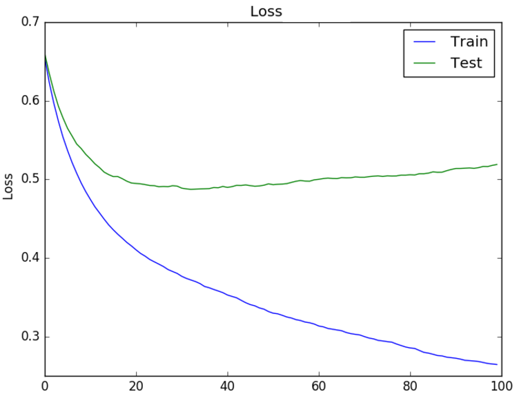
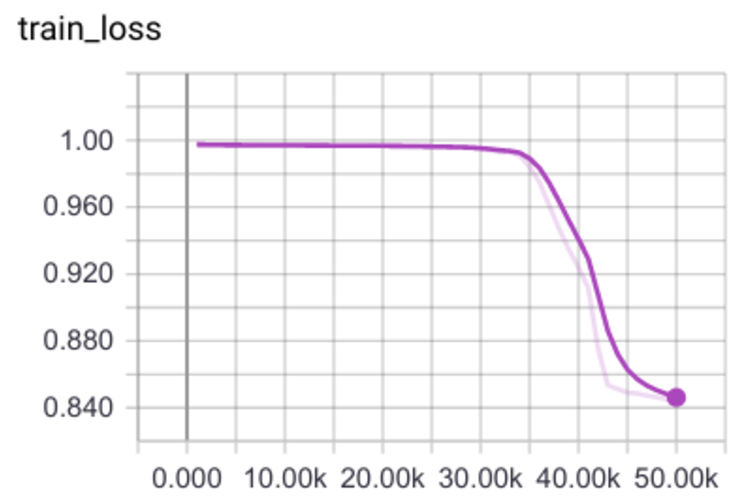
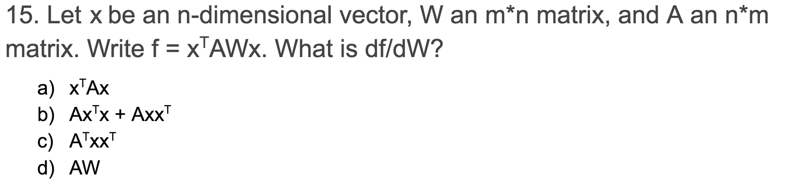

## The 40 Machine Learning Theory questions I got during an interview - 1 
**(Keep updated)**

##### The following content is from a Machine Learning Theory exam I took when I applied for a machine learning engineer, I had to finish 40 questions in 40 minutes. The reason why I especially post this article and the next one is that help me out to keep my interview's record and review what I went through the entire process here. By blog posting to review what I have to improve immediately, also strengthen my basic domain knowledge. I'll put this on my Github and set it public. Do not hesitate to send me the pull request, if there is any issue in the reviews below.

---

1. Given the train and test loss curves below, what actions would help?

    [ {:class="img-responsive"} ](../assets/img/posts/merantix_interview/1.png)
    
    - [x] Increase model capacity
    - [x] Add dropout
    - [ ] Debug network implementation
    - [x] Gather more training data  

2. What is the difference between a naive Bayes and a logistic regression model?

    - [x] A Naive Bayes model assumes the features are conditionally independent, a logistic regression does not
    - [ ] Naive Bayes is discriminative, logistic regression generative
    - [ ] Naive Bayes requires a model of the data X given the class y, logistic regression only models the probability of y given X
    - [x] Logistic regression assumes the classes follow a Gaussian distribution, Naive Bayes makes no such assumption

    reference 1: [Comparison between Naïve Bayes and Logistic Regression](https://dataespresso.com/en/2017/10/24/comparison-between-naive-bayes-and-logistic-regression/)
    reference 2: [Logistic Regression for Machine Learning](https://machinelearningmastery.com/logistic-regression-for-machine-learning/)

3. Why is a computation written in Numpy usually faster than the same computation implemented in native Python?

    - [ ] Numpy operations are parallelized on a GPU if your hardware supports this
    - [ ] Unlike Python, Numpy leverages just-in-time compilation
    - [x] Numpy operations are parallelized over multiple CPUs if your hardware supports this
    - [x] Numpy operations are vectorized, which means that array operations don’t go through Python loops

    reference: [VECTORIZATION AND PARALLELIZATION IN PYTHON WITH NUMPY AND PANDAS](https://datascience.blog.wzb.eu/2018/02/02/vectorization-and-parallelization-in-python-with-numpy-and-pandas/)

4. What are major computer vision and machine learning conferences?

    - [ ] ECCV, ICCV, NICR, ICLR, CVPR, ICML
    - [x] ICCV, ICML, ECCV, CVPR, NeurIPS, ICLR
    - [ ] ICML, CVPN, NeurIPS, ICCV, ICLR, ECCV
    - [ ] VACV, ICML, CVPR, NeurIPS, ECCV, ICML

5. As a rule of thumb, how does the accuracy of a model tend to scale with the amount of training data?

    - [ ] Model accuracy scales linearly with the amount of data
    - [ ] Model accuracy scales logarithmically with the amount of data
    - [ ] Model accuracy scales exponentially with the amount of data
    - [x] Model accuracy and the amount of training data are not related

6. **What is the difference between variational inference and sampling in graphical models?**

    - [ ] Variational inferences gives the true value of an approximate posterior
    - [ ] Sampling gives an approximate value of the true posterior
    - [ ] Sampling is often much harder to implement
    - [ ] Variational inference requires a variational autoencoder

7. You are given a revolver with six slots. There are two adjacent bullets. You have to shoot twice and are given the chance to rotate the cylinder randomly in-between. How do you maximize your chance of survival?

    - [ ] Rotate cylinder
    - [x] Do not rotate cylinder
    - [ ] It does not matter, as the survival chance is the same in both cases
    - [x] The question does not give all information required to answer the question

8. While training a model, you see it start to output NaN as its loss value. Which of the following is most likely to remedy this?

    - [ ] Reduce the size of your training data set
    - [ ] Increase the number of parameters in your model
    - [x] Reduce your learning rate
    - [ ] Increase your learning rate

9. Why do researchers tend to split their dataset into 3 parts (training, validation, testing)?

    - [x] To have 2 independent subsets (validation and testing) on which they can constantly evaluate
    - [ ] There is no good reason for that, it is just a convention
    - [x] To make sure that the model generalizes well
    - [ ] To be able to tune hyperparameters properly

10. You are trying to predict a continuous variable with your model. Instead of training it for regression you decide to discretize the variable and train the model for classification instead. Why would you do it?

    - [x] There is no argument for doing so
    - [ ] The accuracy of the model will be much higher
    - [x] You cannot train a neural network for regression
    - [ ] When training for regression the optimization can be less stable

11. You see this training plot, the learning rate was constant during training. What do you suspect went wrong?
    
    [ {:class="img-responsive"} ](../assets/img/posts/merantix_interview/11.png)

    - [ ] Learning rate too high
    - [x] Learning rate too low
    - [ ] Bad model initialization
    - [ ] Model capacity not large enough

12. You’re considering adding one of the following layers in the middle of your neural network. Which of them is NOT differentiable for backpropagation?

    - [ ] Batch normalization
    - [ ] Convolution
    - [ ] Dropout
    - [x] Argmax

13. How does the number of parameters in three consecutive layers of stride-1 3x3 convolutions compare to that of a single layer of a 7x7 convolution (all convolutions have the same number of output channels)?

    - [ ] The single 7x7 layer has a larger receptive field
    - [ ] The three 3x3 stride 1 convolutional layers have a larger receptive field
    - [ ] They have the same receptive field
    - [x] You cannot compare these layers

14. How does the number of parameters in three consecutive layers of stride-1 3x3 convolutions compare to that of a single layer of a 7x7 convolution?

    - [ ] The single 7x7 layer has fewer parameters
    - [ ] The three 3x3 stride 1 convolutional layers have fewer parameters
    - [ ] They have the same number of parameters
    - [x] You cannot compare these layers

15. Please select your answer(s) below:

    [ {:class="img-responsive"} ](../assets/img/posts/merantix_interview/15.png)

    - [ ] a
    - [ ] b
    - [ ] c
    - [ ] d

16. You’re training a softmax classifier on 23 classes. What do you expect the cross-entropy loss and accuracy to be at the beginning, assuming proper initialization?

    - [ ] Loss: 2.3, accuracy: 4.3%
    - [ ] Loss: 3.1, accuracy: 4.3%
    - [ ] Loss: 2.3, accuracy: 10%
    - [ ] Loss: 3.1, accuracy: 10%

17. A dust particle starts flying around from the point (1, 1) in the xy plane. What’s the probability that the first time it hits the x-axis is on the negative half?

    - [ ] ½
    - [ ] ⅓
    - [ ] ¼
    - [ ] ⅛

18. What can you try to increase the performance of a model when training and testing accuracy converges to about the same?

    - [ ] Decrease the model capacity
    - [ ] Performance cannot get any better
    - [x] Increase the model capacity
    - [ ] Early stopping

19. You are training a model using ReLU activation functions. After some training, you notice many units never activate.  What are some plausible actions you could take to get more units to activate? Check all that apply:

    - [x] Use Leaky ReLU units
    - [x] Use a momentum-based gradient method during backpropagation
    - [x] Add positive bias when initializing weights
    - [ ] Decrease batch size

20. Let's compare the following methods for hyperparameter optimization: Random Search, Grid Search and Bayesian Hyperparameter Optimization. Which of the following statements are true?

    - [ ] Grid Search is better than Random Search because we can express our domain knowledge about hyperparameters more precisely because the former is deterministic
    - [x] Bayesian Hyperparameter Optimization is preferable over Random Search because we can leverage knowledge about what we have learned during prior optimization runs
    - [ ] Random Search is preferable over Grid Search because while exploring irrelevant changes in some hyperparameters we may still explore relevant changes in others
    - [ ] Bayesian Hyperparameter Optimization and Random Search are equally preferable because for both we can specify our prior assumptions in terms of probability distributions

    Reference: [Automated Machine Learning Hyperparameter Tuning in Python](https://towardsdatascience.com/automated-machine-learning-hyperparameter-tuning-in-python-dfda59b72f8a)