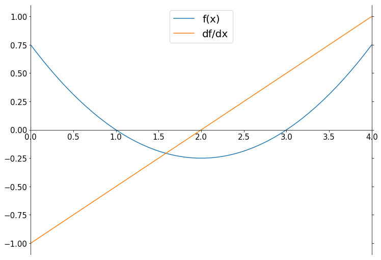
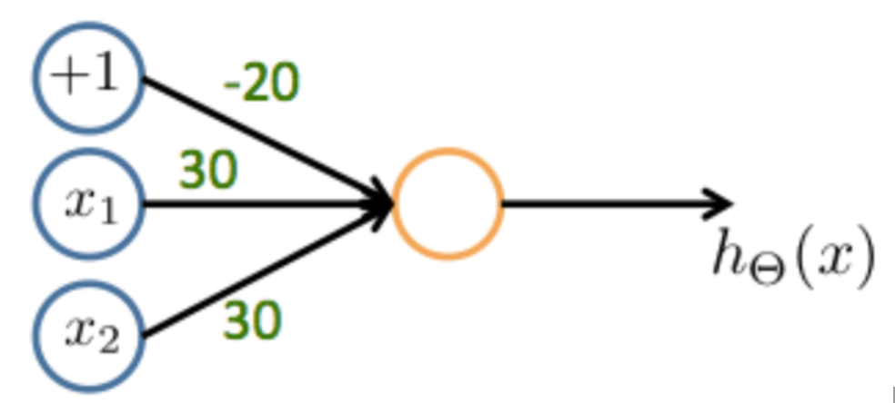
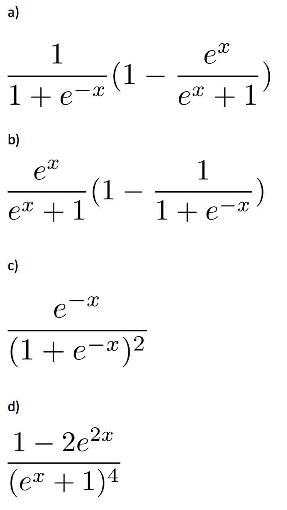

## The 40 Machine Learning Theory questions I got during an interview - 2
**(Keep updated)**

21. Dictionary keys in Python must be:

    - [ ] Alphanumeric
    - [ ] Hashable types
    - [ ] Iterables
    - [ ] Implement the __dict__() method

22. Select the Pokemon!

    - [ ] Koffing
    - [ ] Keras
    - [ ] Theano
    - [ ] Pandas

23. What is the output size of a 7x7x1 picture after a convolutional layer with a single filter with size 3x3,  no padding and strides of 1 in each direction?

    - [ ] 7x7x1
    - [ ] 6x6x1
    - [ ] 4x4x1
    - [ ] 5x5x1

24. Which of the following is not a regularization method?

    - [ ] Dropout
    - [ ] Parameter sharing
    - [ ] RMSprop
    - [ ] Early stopping

25. Which of the following activation results in the highest output when x = 2?

    - [ ] Tanh(x)
    - [ ] ReLU(x)
    - [ ] Sigmoid(x)
    - [ ] ELU(x)

26. The primary contribution of Resnet [2015] was:

    - [ ] iteratively training two neural nets in a zero-sum framework
    - [ ] adding a differentiable read/write external memory bank
    - [ ] using fully convolution CNNs, to accept any input image size
    - [ ] using skip connections to train deeper networks

27. Which of the following are techniques for parallelizing neural net training?

    - [ ] Train model with different examples on different servers
    - [ ] Calculate forward pass and backward pass separately
    - [ ] Train parts of very large models on different servers
    - [ ] Keep input data and model parameters on separate servers

28. The main advantage of training NN’s on GPU’s is:

    - [ ] fast memory loading
    - [ ] energy efficiency
    - [ ] greater parallelism
    - [ ] cheaper hardware

29. EM (expectation maximization) is

    - [ ] A segmentation algorithm
    - [ ] An optimization technique for latent variable models
    - [ ] A clustering algorithm
    - [ ] A popular inference algorithm for conditional random fields

30. A class of functions, F, can shatter a dataset of size n if:

    - [ ] it achieves zero training loss on every possible labelling of the dataset
    - [ ] it achieves zero evaluation loss on every possible labelling of the dataset
    - [ ] it has sufficient capacity
    - [ ] it has infinite VC dimension

31. Starting from x=0, which of the following optimisation methods will converge to the minimum at x=2 of the function f(x) shown below?

    [ {:class="img-responsive"} ](../assets/img/posts/merantix_interview/31.png)

    - [ ] Gradient descent with learning rate 4
    - [ ] Newton’s method applied to f(x)
    - [ ] Newton’s method applied to the derivative df/dx
    - [ ] Gradient descent with learning rate 1

32. Which of the following are non-linear classifiers?

    - [ ] PCA
    - [ ] VGG-16
    - [ ] Random Forest
    - [ ] SVM (no kernel)

33. Consider the following neural network with the given weights. Which boolean functions does it compute, if we’re using sigmoid as the activation function? (image below)

    [ {:class="img-responsive"} ](../assets/img/posts/merantix_interview/33.png)

    - [ ] OR
    - [ ] AND
    - [ ] NAND
    - [ ] XOR

34. Which of the following is the first derivative of the sigmoid function (image below)?

    [ {:class="img-responsive"} ](../assets/img/posts/merantix_interview/34.png)
    
    - [ ] a)
    - [ ] b)
    - [ ] c)
    - [ ] d)

35. Assuming your data exists on some compact subset of R^n, how many hidden layers are necessary for a neural network to be able to represent any continuous function?

    - [ ] 0
    - [ ] 1
    - [ ] 2
    - [ ] 10

36. You train a GAN to generate pictures of cute dogs and cats (30% dogs, 70% cats) by sampling the latent variable from a high dimensional, isotropic (no covariance) Gaussian with mean/mode 0 and variance 1 feeding through the generator. After training, you feed the 0 vector through your generator. Your sample looks nothing like a dog. Why?

    - [ ] The network has only learned to generate cat-dog hybrids
    - [ ] A Gaussian distribution with mean 0 and 1 variance is not the right distribution for this task
    - [ ] The network has seen almost no training points "close" to the mode
    - [ ] The mode corresponds to the most probable class, i.e. a cat not a dog

37. When training a neural net, what is an advantage of using minibatch gradient descent over single-example gradient descent

    - [ ] Smoother convergence
    - [ ] Reduces training loss
    - [ ] Allows for batch normalization
    - [ ] Higher training throughput

38. Which of the following perturbations to a normal example are very likely to create an example that would trick a well-trained neural net to predict the wrong class with high confidence?

    - [ ] Adding noise sampled from a Gaussian distribution
    - [ ] Adding a positive multiple of the gradient of the cost function with respect to the input
    - [ ] Adding a negative multiple of the gradient of the cost function with respect to the input.
    - [ ] Adding noise sampled from a Gaussian distribution, and then adding a positive multiple of the gradient of the cost function with respect to the input (after it’s been perturbed by the noise)

39. What can you say about a ROC (receiver operating characteristic) curve vs. a PR (precision recall) curve for evaluating a model?

    - [ ] Both curves have specificity on one of their axes
    - [ ] Both curves have sensitivity on one of their axes
    - [ ] PR curves are invariant to changes in the relative class frequency
    - [ ] ROC curves are invariant to changes in the relative class frequency

40. What are true statements about LSTMs and vanilla RNNs?

    - [ ] LSTM is a type of RNN
    - [ ] Vanilla RNNs are great at handling long-term dependencies
    - [ ] The input and forget gates are coupled in a LSTM
    - [ ] LSTMs often perform better than vanilla RNNs

